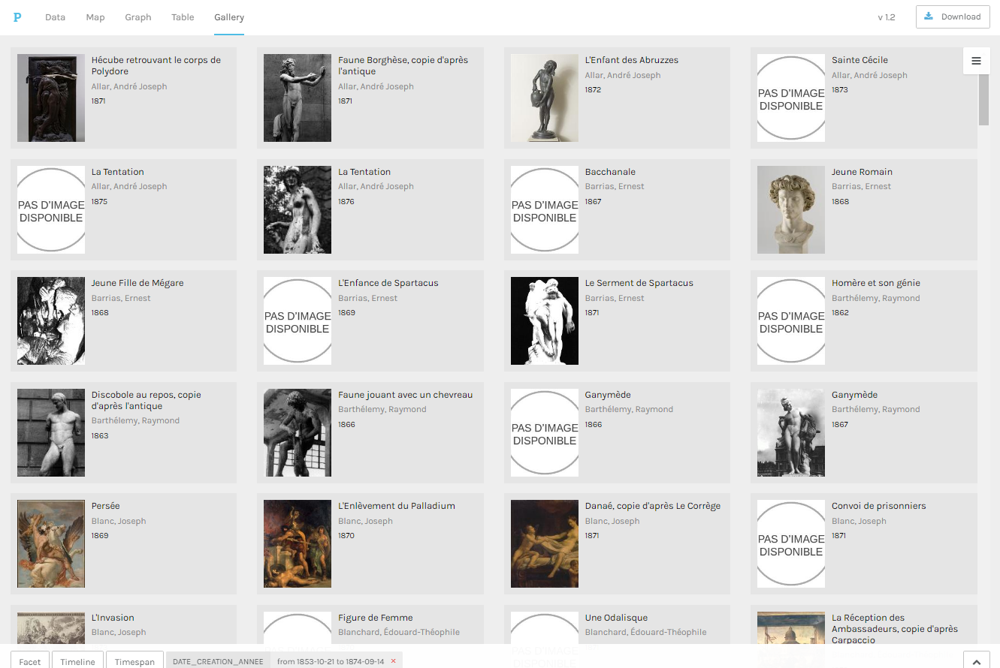
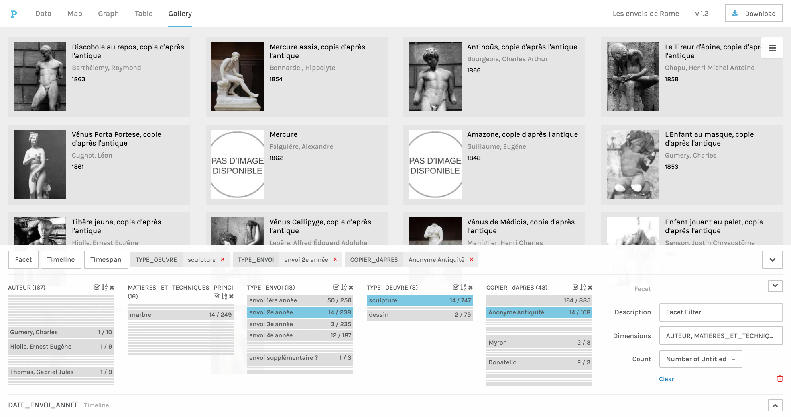

## Tuto
### Comment utiliser Palladio pour explorer le corpus des Envois de Rome

#### Objectifs

* utiliser Palladio pour explorer le corpus des Envois de Rome
* savoir manipuler les différentes options de l'interface

#### A propos de Palladio

Palladio est	une	plateforme de	visualisations	de	données	à	plusieurs	dimensions	(lettres,	personnes,	données
biographiques,	lieux,	etc.).	Il	s’agit	d’un		outil	développé	initalement par	les	membres	du	projet	Mapping	the
Republic	of	Letters à	l’université	de	Stanford	en lien avec le laboratoire Humanities+Design.

**Accéder à l'application :** [http://palladio.designhumanities.org/#/](http://palladio.designhumanities.org/#/)

#### 1ère étape : importer les données

Deux méthodes principales :
* soit en important le jeu de données intial en CSV ([à télécharger ici](../datasets/Export_EnvoisdeRome_oeuvres_20190325.csv))
* soit en important le jeu de données déjà pré-paramétré pour l'utilisation avec Palladio ([à télécharger ici](../datasets/Export_EnvoisdeRome_oeuvres_forPalladio_20190325.json))

Procédure d'import en *gif* :

Une fois les données importées, vous entrez dans l'interface et le menu en haut vous permet d'accéder aux 4 modes d'exploration ainsi qu'à une section "Data" qui contient sous forme de liste l'ensemble des données importées. Les types de données les plus courants sont pris en compte (texte, date, nombres, coordonnées géographiques, url) et seront nécessaires pour réaliser certaines visualisations.

> Vous ne pourrez pas faire de carte si aucune colonne ne contient l'information de lattitude et de longitude. De même, pour créer un filtre chronologique, il faudra avoir dans les données une colonne de type date.

#### Les 4 formes d'exploration

##### La carte

L'accès par carte  permet de visualiser la répartition des Envois de Rome selon leurs lieux de conservation actuels

##### Le graph

Le graph permet de choisir deux variables ("Source" et  "Target") et de visualiser les relations qu'elles entretiennent entre elles. Avec l’option « Size nodes », vous pouvez obtenir des tailles de nœuds proportionnelles au nombre d’objets qu’ils représentent.
Ci-dessous, nous avons choisi la colonne "AUTEUR" et la colonne "COPIE_dAPRES". En sélectionnant des artistes italiens, on peut par exemple répondre à la question suivante : quels sont les auteurs qui ont copié à la fois Michel-Ange et Pinturicchio ? On voit ainsi tout de suite apparaître qu'il n'y a qu'un seul artiste, à savoir Antoine Larée.

##### Le tableau croisé

Le tableau croisé (dans le menu TABLE) permet, après avoir choisi une variable dans les données, d'avoir une concaténation des différents champs de votre choix.
Par exemple, si vous choisissez comme première variable "AUTEUR" et comme diverses dimensions d'analyse, les champs "DATE" et  "TYPE_OEUVRES", vous obtiendrez le résultat suivant :

##### La galerie d'images

Ce dernier mode d'exploration est le plus visuel. Il vous permet de construire avec les informations de votre choix, une galerie de cartels.

Pour construire ces cartels, il suffit de paramétrer et de choisir les champs que vous souhaitez voir apparaître. Attention, pour les illustrations vous devez utiliser la colone URL_IMAGE tandis que pour le champ "LINK", qui renvoie à la notice complète d'AGORHA, il faut choisir "URL_AGORHA".

#### Les filtres

La grande force de Palladio réside principalement dans l'utilisation de filtres dynamiques qui vont interragir avec les informations visualisées selon les 4 modes d'explorations vus ci-dessus.

3 types de filtres existent :

* [Facet] : permet d'afficher les valeurs de vos différentes variables et de construire des filtres multiples. Exemple : on va pouvoir sélectionner uniquement les sculptures qui sont des envois de 2ème année et qui ont été copiées d'après un antique.

* [Timeline] : permet de visualiser et naviguer/sélectionner sur une timeline les variables selon des regroupement de votre choix.

* [Timespan] : tout comme la timeline, ce filtre a l'avantage de permettre de visualiser une période temporelle. Dans l'exemple ci-dessous, il s'agit de visualiser la période entre la date de création de l'oeuvre et la date de l'envoi de l'œuvre. On peut ainsi tout de suite voir des cas sortant de l'ordinaire comme [l'œuvre de Pierre Cavelier intitulée Pénélope](https://agorha.inha.fr/inhaprod/ark:/54721/003260289) (7 ans entre la date de création et la date de l'envoi).

#### Bon à savoir

* **Ne jamais recharger la page** car sinon, vous perdez toutes vos visualisations.
* Malheureusement, l'outil est encore en développement, donc toutes les visualisations ne sont pas encore exportables (il est toujours possible de faire des captures d'écran).
* Pour chaque visualisation, il y a beaucoup d'options, notamment les *tooltip label* qui permettent de choisir ce qui sera affiché dans l'infobulle au passage de la souris.
