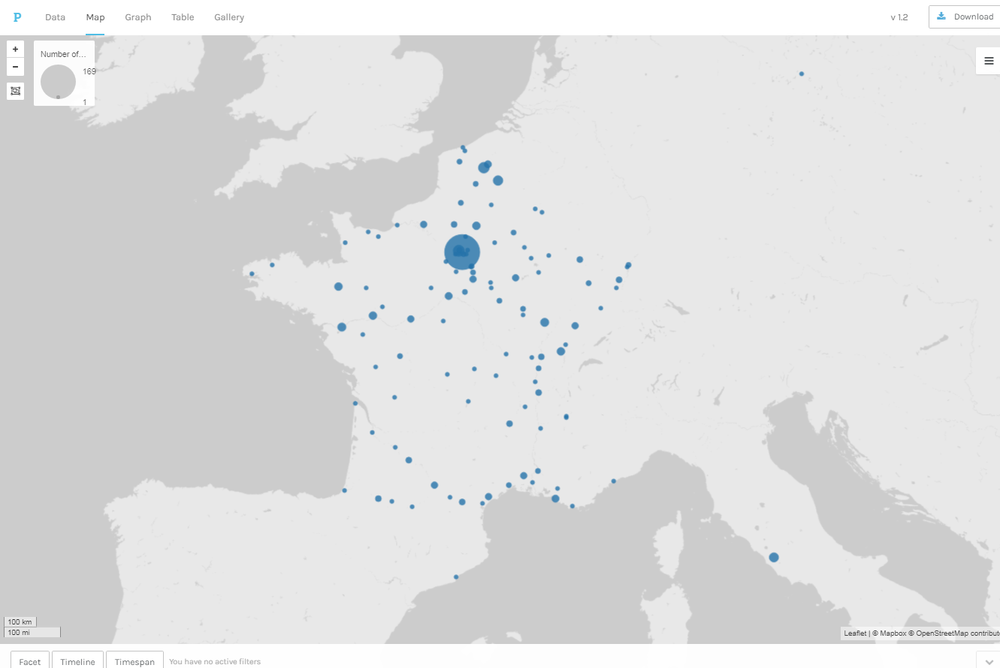
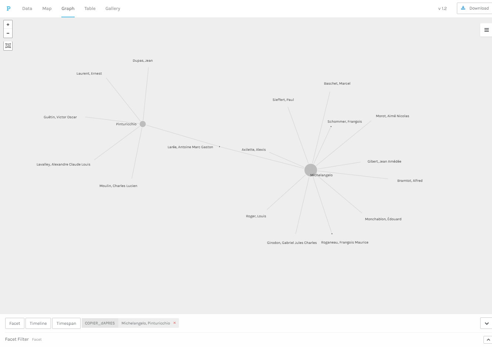
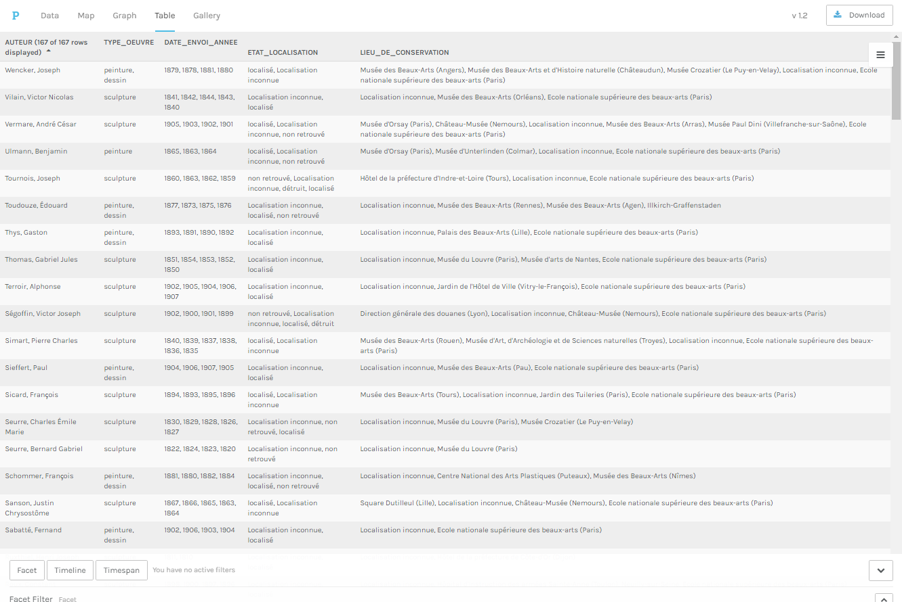
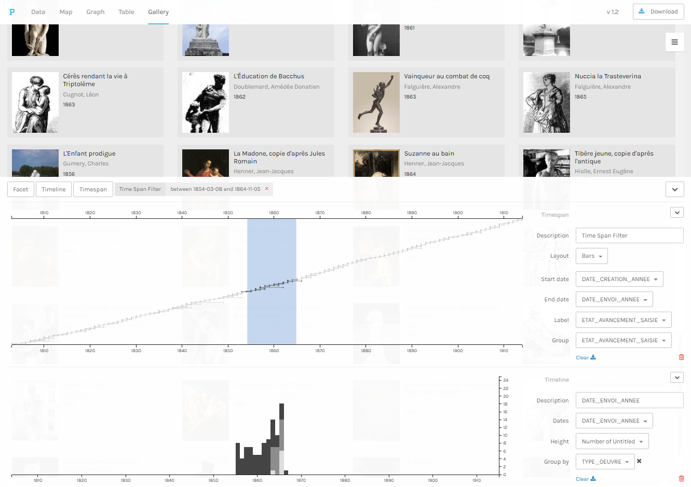

## tutoriels
### Comment utiliser Palladio pour explorer le corpus des Envois de Rome

#### Objectifs

* utiliser Palladio pour explorer le coprus des Envois de Rome
* savoir manipuler les différentes options de l'interface

#### A propos de Palladio

Palladio est	une	plateforme de	visualisations	de	données	à	plusieurs	dimensions	(lettres,	personnes,	données	
biographiques,	lieux,	etc.).	Il	s’agit	d’un		outil	développé	initalement par	les	membres	du	projet	Mapping	the	
Republic	of	Letters à	l’université	de	Stanford	en lien avec le laboratoire Humanities+Design.

**Accéder à l'application :** [http://palladio.designhumanities.org/#/](http://palladio.designhumanities.org/#/)

#### 1er étape : importer les données

Deux méthodes principales :
* soit en important le jeux de données intial en CSV ([à télécharger ici](../datasets/Export_EnvoisdeRome_oeuvres_20190325.csv))
* soit en important un jeux de données déjà pré-paramétré pour l'utilisation avec Palladio ([à télécharger ici](../datasets/Export_EnvoisdeRome_oeuvres_forPalladio_20190325.json)) 

Pour la seconde, méthode, un petit *gif* pour plus d'information

Une fois les données importées,vous entrez dans l'interface et le menu en haut, vous permet d'accéder aux 4 modes d'exploration ainsu qu'une section "Data" qui contient sous forme de liste , l'ensemble de vos données.  Les type de données les plus courants sont suportés (texte, date, nombres, coordonnées géographiques, url) et seront nécessaire pour réaliser certaines visualisations. 

> vous ne pourrez pas faire de carte si aucune colonne ne contient l'information de lattitude et de longitude. De même, pour créer un filtre chronologique, il faudra avoir dans les données, une colonne de type date.

#### Les 4 formes d'exploration

1. La carte

2. Le graphe

3. Le tableau croisé

4. La grille d'image

#### Les filtres

